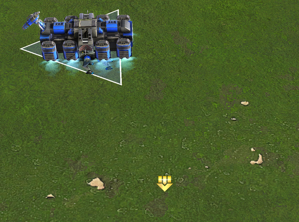

# Transports

## Player commands

### Pickup single unit

Picking up a single unit is when transport is selected and player right-clicks on a unit or uses `load` command by left-clicking a unit.

### Drop single unit

Dropping a single unit is when a transport is selected and player uses `unload` command and left-clicks on terrain.

### Pickup units from area

Picking up multiple units from an area is when one or several transports are selected and player issues `load` command in a circle by dragging with left mouse button.

### Pickup units from area, same type

Picking up multiple units of the same type from an area is when one or several transports are selected and player issues `load` command and holds down `alt` while dragging a circle with left mouse button.

### Drop units in an area

Dropping units in an area is when one or multiple transports are selected and player issues `unload` command in a circle by dragging with left mouse button.

### Drop units in formation

Dropping units in a fortmation is when one or multiple transports are selected and player issues `unload` command in a "line" by dragging with right mouse button.

### Repeat orders

Repeat orders is when player chooses to set one or several transports into repeat mode.

## Transport behavior

### Pickup unit(s)

### Drop unit(s)

### Find unit(s) to pickup

### Find spot to drop unit(s)

## Other Considerations

#### Units enter pickup area

#### Units leave pickup area

#### Drop area is blocked

#### Pickup area has no units while repeat is on 

## Engine

### Commands

The engine provides four commands that are relevant for us here, namely, `LOAD_UNITS`, `LOAD_ONTO`, `UNLOAD_UNITS` and `UNLOAD_UNIT`.

`LOAD_UNITS` can either be used on a single unit (command type icon) or as an area command (map pos and radius).

`LOAD_ONTO` targets a single transport.

`UNLOAD_UNITS` is used to unload all units carried by a transport and is either a single unit (command type icon) or area command (map pos and radius). (TODO: I don't understand the single unit aspect of this command)

`UNLOAD_UNIT` is a map pos command that unloads one unit from the selected transport.

At the time of writing, BAR utilizes only `LOAD_UNITS` and `UNLOAD_UNIT`. `LOAD_ONTO` is not used at all and `UNLOAD_UNITS` is intercepted and switched to `UNLOAD_UNIT`.

### Call-ins

`AllowUnitTransport`, `AllowUnitTransportLoad` and `AllowUnitTransportUnload`.

TODO: Explain what these are and how they are used.

### Call-outs

`GiveOrderToUnit`

TODO: Explain how this works.

### Interface

The engine draws icons for load and unload in various scenarios such as when transport is selected and mouseover a transportable unit.

When selecting load command and dragging with left mouse button held, the engine will draw a blue circle. This circle will stay until the `LOAD_UNITS` command has been completed. If the transport is set to repeat, the circle will stay permanently.

When selecting unload and dragging with left mouse button held, the engine will draw a yellow circle. However, because we intercept and replace the `UNLOAD_UNITS` with `UNLOAD_UNIT`, the circle is immediately removed. Also, if the transport is set to repeat, the unload command is not an area command, but rather a map pos command.

*Transport selected and J for load pressed*

*Left mouse button held and mouse moved to northeast*

*Left mouse button released*

*Transport carrying 3 centaurs selected and U for unload pressed*

*Left mouse button held and mouse moved to northeast*

*Left mouse button released*

## Plan

Figure out if `LOAD_UNITS` provided by the engine works in every way according to our needs.

The engine implements it's own logic for where to drop units when using `UNLOAD_UNITS`. This logic is not tunable and doesn't suit our purposes. Therefore, we need to implement our own unload widget. Furthermore, because we are using a custom made unload widget, we will also need to make a custom ui widget to go with it.
